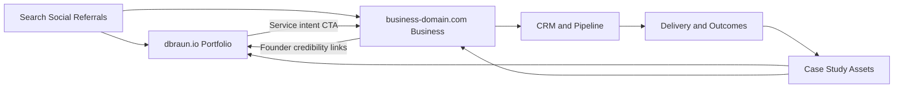
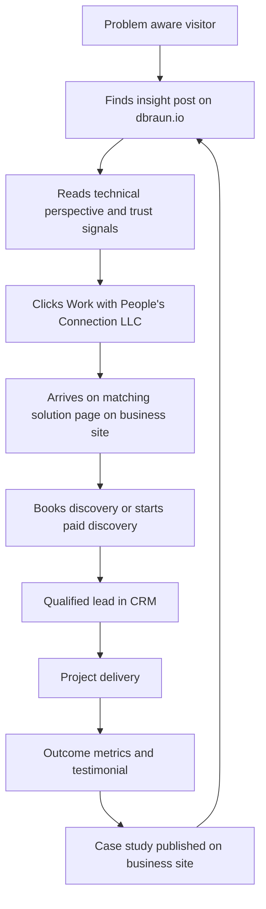
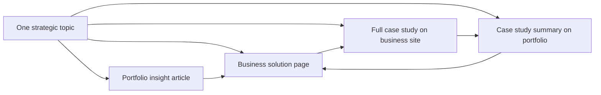

# Cross-Domain Architecture and Content Flow

This document defines how `dbraun.io` and the People's Connection LLC site
work as one system while preserving clean brand roles.

## 1) System Overview

## 2) User Journey Architecture

## 3) Content Production Architecture

## 4) Link Governance Rules

Cross-domain links should be intentional and measurable.

Required rules:

1. Every cross-domain CTA uses UTM parameters.
2. Anchor text is contextual, not generic "click here".
3. Do not mirror full-page copy across domains.
4. Case study pattern:
   - portfolio has a summary
   - business has the complete commercial narrative
5. Founder pattern:
   - business links to portfolio for technical depth
   - portfolio links to business for commercial engagement

## 5) SEO Entity Architecture

Use structured data and clear topic boundaries:

- Portfolio (`dbraun.io`)
  - Core entities: `Person`, `Article`, `CreativeWork`
  - Intent: expertise, thought leadership, technical trust
- Business (`business-domain.com`)
  - Core entities: `Organization`, `Service`, `FAQPage`, `Product` (if package)
  - Intent: service discovery, solution fit, buying

## 6) Canonical and Indexing Rules

1. Each page canonical points to itself on its own domain.
2. No cross-domain canonical unless content is truly duplicated.
3. If duplicate snippets are unavoidable, keep business page as canonical source.
4. Keep staging domains `noindex`.

## 7) Analytics and Attribution Blueprint

Track in one shared analytics model:

- Event: `cross_domain_click`
  - params: `from_domain`, `to_domain`, `source_page`, `target_page`, `cta_id`
- Event: `book_call_submit`
  - params: `landing_domain`, `landing_page`, `utm_source`, `utm_campaign`
- Event: `paid_discovery_start`
- Event: `qualified_lead`

Recommended funnel views:

1. Portfolio page -> Business landing page -> Book call
2. Portfolio page -> Business landing page -> Paid discovery
3. Business SEO landing -> Book call (direct conversion)

## 8) Technical Integration Checklist

1. Shared event naming spec across both sites
2. Shared UTM schema
3. Shared design tokens for brand continuity (not identical UI)
4. Shared case-study data model fields:
   - problem
   - constraints
   - implementation
   - measurable outcomes
   - testimonial
5. Shared internal linking rules in editorial checklist

## 9) Build-First Architecture Decisions

Ship these before expanding content volume:

1. Cross-domain CTA endpoints and UTM links
2. CRM capture and lead source tracking
3. Case-study dual-format template (summary + full)
4. Founder credibility bridge pages both directions
