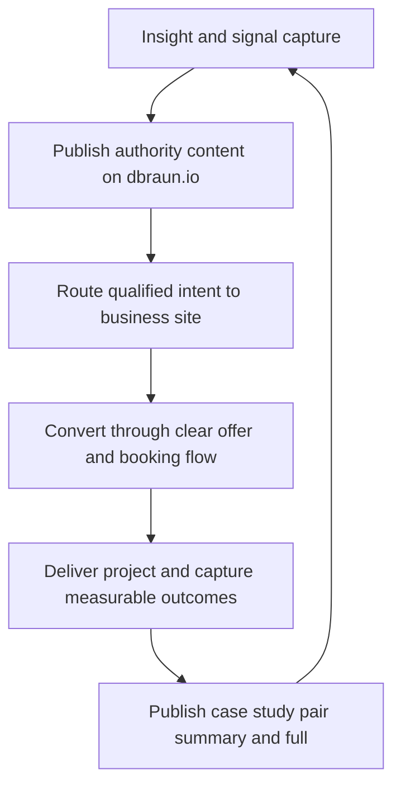

# Execution Playbook: Build a Category-Level Presence

This playbook is written for immediate execution so you can start tomorrow.
It combines positioning, build sequence, and operating cadence.

## 1) Positioning Framework

Objective:

- Present David Braun as a next-generation systems thinker who combines
  engineering, strategy, and execution.

Positioning line:

- "I design and ship the systems that make the future operational."

Supporting identity pillars:

1. System Architect
   - You do not just write code; you design end-to-end operating systems.
2. Applied Futurist
   - You translate emerging technology into real outcomes now.
3. Outcome Operator
   - You are measured by shipped solutions and measurable impact.

## 2) Messaging Architecture by Site

### Portfolio (`dbraun.io`) voice

- Personal, technical, principled.
- Focus: how you think, how you solve, what you have built.

Hero copy template:

- Headline: "Building the systems behind what is next."
- Subhead: "I help teams turn complex ideas into working products, secure
  operations, and measurable outcomes."
- CTA: "Work with People's Connection LLC"

### Business (`business-domain.com`) voice

- Commercial, clear, outcome-driven.
- Focus: what gets solved, how engagement works, what results to expect.

Hero copy template:

- Headline: "People's Connection LLC helps you ship what matters."
- Subhead: "From strategy to implementation, we deliver practical systems that
  improve speed, reliability, and growth."
- CTA: "Book Discovery"

## 3) Operating Diagram

## 4) 12-Week Build Plan

## Week 1 (Tomorrow Start)

Delivery target:

- Launch a production-ready skeleton for business site and cross-domain links.

Tasks:

1. Pick final business domain and set DNS.
2. Create business site repo and baseline Next.js stack.
3. Ship pages:
   - `/`
   - `/services`
   - `/book`
   - `/about/founder`
4. Add `dbraun.io/work-with-peoples-connection` bridge page.
5. Implement UTM-tagged cross-domain CTAs.
6. Add analytics events:
   - `cross_domain_click`
   - `book_call_submit`

## Weeks 2-4

Delivery target:

- First real conversion system and trust proof.

Tasks:

1. Publish 3 service pages with clear ICP and outcomes.
2. Publish 2 full business case studies.
3. Publish matching summary case studies on portfolio.
4. Connect CRM pipeline stages:
   - new lead
   - qualified
   - proposal
   - won/lost
5. Add paid discovery offer page and checkout.

## Weeks 5-8

Delivery target:

- SEO engine and content distribution loop.

Tasks:

1. Build 6-10 solution pages (problem-intent keywords).
2. Publish 4 high-signal insight posts on portfolio.
3. Create repurposing pipeline:
   - article -> short video -> social thread -> newsletter excerpt
4. Add internal linking blocks on all relevant pages.

## Weeks 9-12

Delivery target:

- Scale operations and close attribution gaps.

Tasks:

1. Build monthly performance dashboard.
2. Add SOPs for content, lead handling, and case-study publication.
3. Run conversion experiments on:
   - hero CTA text
   - pricing framing
   - discovery form length
4. Ship one flagship "future-facing" thought piece with strong distribution.

## 5) Content System You Can Run Weekly

Weekly cadence:

1. Monday: one insight draft on portfolio.
2. Tuesday: one matching business solution section update.
3. Wednesday: one case-study metric update.
4. Thursday: one newsletter or social repurpose batch.
5. Friday: analytics review and next-week planning.

## 6) Quality Bar: Top-Notch Standards

Every major page should have:

1. Clear audience + problem statement above the fold
2. Measurable outcome examples
3. Single primary CTA
4. One cross-domain trust link where relevant
5. Schema markup aligned to page intent
6. Baseline accessibility and performance checks in CI

## 7) KPI Targets (First 90 Days)

Track and review every week:

1. Portfolio -> business click-through rate
2. Business landing -> booked call conversion rate
3. Paid discovery start rate
4. Qualified lead rate
5. Content-assisted conversion share
6. Search impressions and top 20 keyword movement

## 8) First-Day Task List (Literal Tomorrow Checklist)

1. Register/confirm business domain.
2. Create business site repo and deploy preview.
3. Implement 4 core pages (`/`, `/services`, `/book`, `/about/founder`).
4. Add cross-links in both nav/footer areas.
5. Add one bridge page on `dbraun.io`.
6. Configure analytics events and test event payloads.
7. Publish one short announcement post on `dbraun.io` introducing the split.

If you complete these seven items, you will have a working foundation rather
than just a plan.
